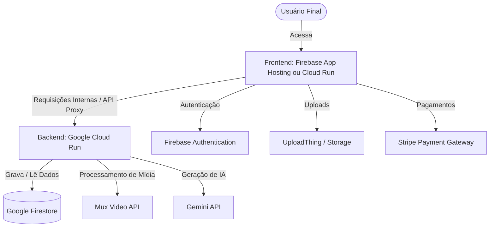

# Guia de Migração para Google Cloud Platform (GCP) & Firebase
Este documento detalha o passo a passo para migrar o Frontend (Next.js) e o Backend (Flask) do ambiente de desenvolvimento local para os serviços de nuvem do Firebase e Google Cloud Services (GCS / GCP).

---

## 🏗️ Visão Geral da Arquitetura em Produção



Para garantir escalabilidade com custo mínimo (serverless), a arquitetura recomendada na nuvem é:
1. **Backend (Python / Flask):** Hospedado no **Google Cloud Run** via contêiner Docker. O Cloud Run escala automaticamente de forma independente (inclusive para zero quando não há tráfego, economizando custos).
2. **Frontend (Next.js SSR):** Hospedado no **Firebase App Hosting** (que gerencia o build do Next.js automaticamente integrado ao GitHub) ou no **Google Cloud Run** (usando o Dockerfile criado).
3. **Banco de Dados (Firestore) & Auth:** Já gerenciados nativamente pelo Firebase.

---

## 📋 Pré-requisitos na Nuvem

1. **Conta e Projeto Google Cloud / Firebase:**
   * Certifique-se de que o seu projeto no Firebase esteja no plano **Blaze** (Pay-as-you-go). O plano gratuito (Spark) impede a saída de rede para APIs externas (como Mux, UploadThing e Gemini) e não suporta o Firebase App Hosting.
   * [Link para Upgrade do Plano Firebase](https://console.firebase.google.com/project/_/overview?purchaseBillingPlan=metered)
2. **Instalação do Google Cloud SDK (gcloud CLI):**
   * Baixe e instale a CLI do Google Cloud na sua máquina local: [gcloud CLI Install](https://cloud.google.com/sdk/docs/install).
   * Inicialize a CLI rodando no terminal:
     ```bash
     gcloud init
     ```
     *(Selecione sua conta do Google e escolha o ID do projeto do Firebase criado para a aplicação).*

---

## ⚡ Passo 1: Implantação do Backend (Flask) no Google Cloud Run

Como o backend Flask é um servidor web tradicional em Python rodando em contêiner, o **Google Cloud Run** é a plataforma ideal para hospedá-lo.

### 1.1 Habilitar as APIs Necessárias no GCP
No terminal da sua máquina local, execute o comando abaixo para ativar os serviços necessários no seu projeto do Google Cloud:
```bash
gcloud services enable run.googleapis.com artifactregistry.googleapis.com secretmanager.googleapis.com
```

### 1.2 Criar o Repositório no Artifact Registry
Crie um repositório seguro no Artifact Registry para guardar as imagens Docker do seu backend:
```bash
gcloud artifacts repositories create lms-backend-repo \
    --repository-format=docker \
    --location=us-central1 \
    --description="Repositorio de Imagens Docker do LMS Backend"
```

### 1.3 Compilar e Enviar a Imagem Docker (Cloud Build)
Envie o código do seu backend diretamente para ser compilado com segurança na nuvem do Google Cloud:
```bash
# Execute este comando a partir da pasta /backend
cd backend
gcloud builds submit --tag us-central1-docker.pkg.dev/SEU_PROJECT_ID/lms-backend-repo/lms-backend:latest .
```
*(Substitua `SEU_PROJECT_ID` pelo ID real do seu projeto no Firebase/GCP).*

### 1.4 Configurar as Chaves no Secret Manager (Segurança Padrão)
Para manter chaves e credenciais seguras sem expor nas variáveis de ambiente públicas, crie Secrets no GCP para as chaves sensíveis:
```bash
# Exemplo para a API do Gemini
gcloud secrets create GEMINI_API_KEY --replication-policy="automatic"
echo -n "sua_chave_do_gemini" | gcloud secrets versions add GEMINI_API_KEY --data-file=-

# Faça o mesmo para outras chaves sensíveis:
# - MUX_TOKEN_ID
# - MUX_TOKEN_SECRET
# - UPLOADTHING_SECRET
# - STRIPE_API_KEY
# - STRIPE_WEBHOOK_SECRET
```

### 1.5 Realizar o Deploy do Backend no Cloud Run
Com a imagem gerada e os segredos criados, faça o deploy do contêiner rodando:
```bash
gcloud run deploy lms-backend \
    --image us-central1-docker.pkg.dev/SEU_PROJECT_ID/lms-backend-repo/lms-backend:latest \
    --platform managed \
    --region us-central1 \
    --allow-unauthenticated \
    --port 5328 \
    --update-env-vars FLASK_DEBUG=0,BACKEND_PORT=5328,NEXT_PUBLIC_FIREBASE_PROJECT_ID=SEU_PROJECT_ID,FIRESTORE_DATABASE_ID=db-lms-project \
    --update-secrets GEMINI_API_KEY=GEMINI_API_KEY:latest,MUX_TOKEN_ID=MUX_TOKEN_ID:latest,MUX_TOKEN_SECRET=MUX_TOKEN_SECRET:latest,UPLOADTHING_SECRET=UPLOADTHING_SECRET:latest,STRIPE_API_KEY=STRIPE_API_KEY:latest
```

> [!IMPORTANT]
> Salve a **URL pública gerada** no final desse deploy (ex: `https://lms-backend-xxxxxx.a.run.app`). Ela será usada como `FLASK_API_URL` na configuração do Frontend.

---

## 🌐 Passo 2: Implantação do Frontend (Next.js)

Temos duas formas de implantar o Next.js na nuvem. Escolha a que melhor se adapta ao seu fluxo:

### Opção A: Firebase App Hosting (Recomendada & Serverless)
O Firebase App Hosting gerencia o build do Next.js de forma totalmente nativa, lidando com Server-Side Rendering (SSR) e gerando otimizações automáticas integradas ao GitHub.

#### A.1 Criar Configuração `apphosting.yaml`
Crie um arquivo na pasta `/frontend/apphosting.yaml` para configurar as variáveis em tempo de execução:
```yaml
# frontend/apphosting.yaml
headers: []
env:
  - name: NEXT_PUBLIC_AUTH_PROVIDER
    value: "nextauth"
  - name: NEXT_PUBLIC_FIREBASE_PROJECT_ID
    value: "SEU_PROJECT_ID"
  - name: FLASK_API_URL
    value: "https://URL-DO-SEU-BACKEND-NO-CLOUD-RUN"
  - name: NEXTAUTH_URL
    value: "https://URL-FINAL-DO-SEU-APP-NO-FIREBASE"
  - name: NEXT_PUBLIC_APP_URL
    value: "https://URL-FINAL-DO-SEU-APP-NO-FIREBASE"
```

#### A.2 Conectar ao Console do Firebase
1. Acesse o [Console do Firebase](https://console.firebase.google.com/).
2. Vá no menu lateral em **Build > App Hosting**.
3. Clique em **Get started** ou **Add backend**.
4. Conecte sua conta do GitHub e selecione o repositório do seu projeto.
5. Selecione a branch correspondente (ex: `desenvolvimento-diego-gcs` ou `main`).
6. Configure as variáveis de ambiente sensíveis (como `NEXTAUTH_SECRET`, `FIREBASE_PRIVATE_KEY`, `UPLOADTHING_SECRET`) diretamente no painel do App Hosting para que sejam criptografadas de forma segura.
7. O Firebase App Hosting irá rodar o build e publicar o site automaticamente a cada `git push` na branch configurada.

---

### Opção B: Google Cloud Run (Dockerizada e Unificada)
Caso queira maior controle sobre o contêiner ou não utilize repositório GitHub acoplado, você pode hospedar o frontend no Cloud Run usando a imagem gerada pelo Dockerfile que criamos.

#### B.1 Compilar e Enviar a Imagem do Frontend
```bash
# Execute a partir da pasta /frontend
cd frontend
gcloud builds submit --tag us-central1-docker.pkg.dev/SEU_PROJECT_ID/lms-backend-repo/lms-frontend:latest .
```

#### B.2 Deploy do Frontend no Cloud Run
```bash
gcloud run deploy lms-frontend \
    --image us-central1-docker.pkg.dev/SEU_PROJECT_ID/lms-backend-repo/lms-frontend:latest \
    --platform managed \
    --region us-central1 \
    --allow-unauthenticated \
    --port 3000 \
    --update-env-vars NODE_ENV=production,PORT=3000,FLASK_API_URL=https://URL-DO-SEU-BACKEND-NO-CLOUD-RUN,NEXT_PUBLIC_FIREBASE_PROJECT_ID=SEU_PROJECT_ID,NEXTAUTH_URL=https://URL-DO-SEU-FRONTEND-FINAL \
    --update-secrets NEXTAUTH_SECRET=NEXTAUTH_SECRET:latest,FIREBASE_PRIVATE_KEY=FIREBASE_PRIVATE_KEY:latest
```

---

## 🔐 Passo 3: Ajustes de Segurança & Integrações Pós-Deploy

### 3.1 Habilitar o CORS no Backend Flask
Para permitir que o Frontend de produção faça chamadas para o Backend, o backend precisa aceitar requisições da URL do frontend.
No backend, as origens são configuradas de acordo com as variáveis de ambiente. Verifique se o backend está configurado para aceitar a URL de produção do frontend nas configurações de CORS.

### 3.2 Atualizar as Regras de Domínio Autorizado no Firebase Auth
No Console do Firebase:
1. Vá em **Authentication > Settings > Authorized Domains**.
2. Adicione os domínios gerados pelo Firebase App Hosting ou Cloud Run (ex: `lms-frontend.web.app` ou a URL do Cloud Run).
3. Isso garante que o login via Google/Firebase funcione corretamente no ambiente de produção.

### 3.3 Deploy dos Índices e Regras de Segurança
Se você fez alterações locais nas regras do Firestore ou nos índices, envie-os para a nuvem usando a CLI do Firebase:
```bash
npx -y firebase-tools@latest deploy --only firestore
```

---

## 🛠️ Resumo de Comandos Rápidos para Atualizações Futuras

Sempre que alterar o código local e quiser enviar a versão atualizada para produção:

* **Atualizar o Backend Flask:**
  ```bash
  cd backend
  gcloud builds submit --tag us-central1-docker.pkg.dev/SEU_PROJECT_ID/lms-backend-repo/lms-backend:latest .
  gcloud run deploy lms-backend --image us-central1-docker.pkg.dev/SEU_PROJECT_ID/lms-backend-repo/lms-backend:latest --region us-central1
  ```

* **Atualizar o Frontend Next.js (Se usar Opção A - App Hosting):**
  Basta dar push no Git:
  ```bash
  git add .
  git commit -m "feat: minha atualizacao"
  git push origin desenvolvimento-diego-gcs
  ```
  *(O Firebase App Hosting detecta o push e faz o rebuild/deploy automático).*
